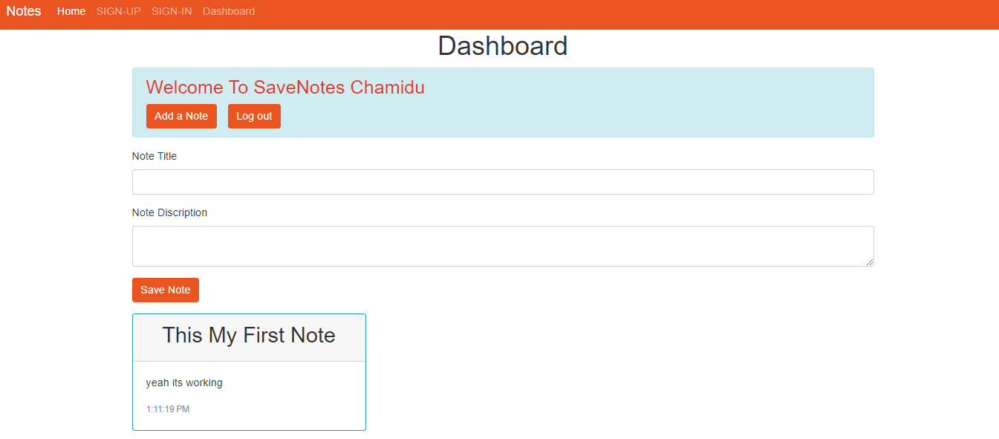

# Save-Notes-WebApp-React-Nodejs-mongodb
 A Save notes webapp, built in React and Nodejs and mongodb
 
 ## **Summary: A React app that uses react-router and axios to interact with an Nodejs Express API connecting to mongodb**
 
 
 
 
 ## About
 ---

- Signup / login (JWT Authentication)
- Create, read Notes.
- Save all user details and Notes on Database (mongodb)
- save user Details on local storage so use no need keep loging again and again(Keep the user logged in, after the browser window has closed).
- Authentication of a route before allowing access to the page.


## Tech Stack
---

#### Front End

- react-router-dom
- react-hook-form and joi for validation
- axios
- bootstrap

#### Back end

- bcrypt
- cors
- express
- express-rate-limit
- joi
- jsonwebtoken
- monk

## Instructions
---

```
# clone repo
git clone https://github.com/buminduyasith/Save-Notes-WebApp-React-Nodejs-mongodb
 
 **front end**
 
# navigate to repo 
cd frontend

# install deps
npm install

 **Backend**
 
# navigate to repo 
cd backend

# install deps
npm install


# Navigate to http://localhost:3000
```
